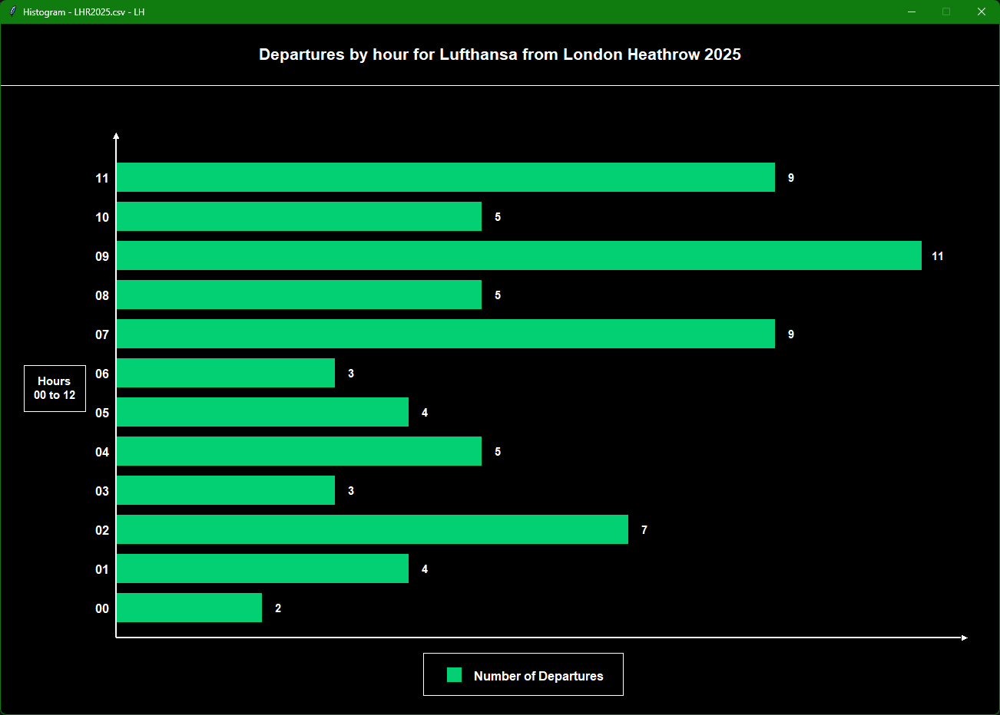
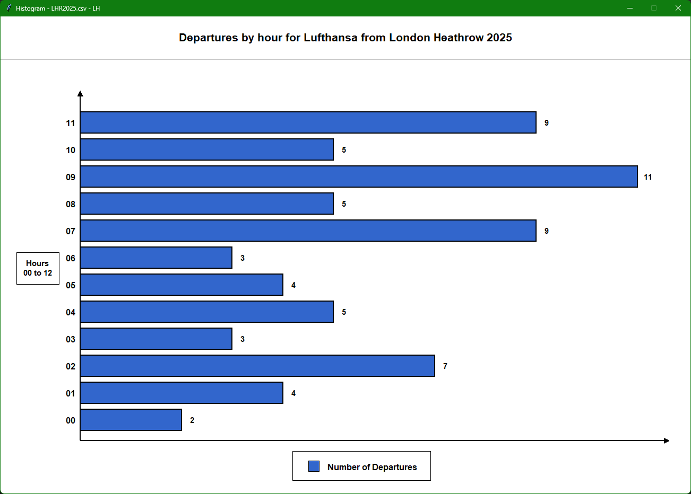

# Airport Survey Analyzer ✈️📊

A **Python-based flight survey analysis tool** that processes airport departure data from CSV datasets and generates statistical insights along with graphical histogram visualizations.

The system allows users to analyze airport operational data such as **flight counts, airline activity, weather conditions, delays, and destination trends**, and visualize hourly departure patterns for selected airlines.

This project demonstrates practical applications of **data processing, file handling, statistical analysis, error handling, and graphical visualization using Python**.

---

# Project Overview

Airports collect large volumes of operational data from flight surveys. Analyzing this information can help understand airline traffic patterns, delays, and environmental factors affecting airport operations.

This application processes airport flight data stored in CSV files and generates meaningful statistics from it. It also creates an **interactive histogram visualization** showing the number of departures per hour for a selected airline.

The system is designed to support **airport survey analysis and decision making** by extracting insights from raw flight data.

---

# Key Features

- CSV flight data processing
- Airport and airline code validation
- Statistical analysis of airport operations
- Flight delay analysis
- Weather condition analysis
- Destination frequency analysis
- Histogram visualization of hourly departures
- Console output and persistent result logging
- Error handling for missing modules and invalid inputs
- Customizable histogram themes (Light / Dark)

---

# Project Structure

```
Airport-Survey-Analyzer
│
├── Airport Survey Analyser.py     # Main program
├── graphics.py                    # Graphics library used for visualization
├── LHR2025.csv                    # Example flight dataset
├── CDG2021.csv                    # Example flight dataset
├── results.txt                    # Output results file
├── README.md                      # Project documentation
```

---

# How the System Works

The program follows a structured workflow:

```
User Input
     ↓
CSV File Selection
     ↓
Load Dataset
     ↓
Data Processing & Analysis
     ↓
Display Statistics
     ↓
Save Results to File
     ↓
Generate Histogram Visualization
```

The system continuously allows users to analyze different datasets until they choose to exit.

---

# Program Workflow

The application follows the following algorithm:

1. Start the program
2. Prompt user for a **valid airport code**
3. Prompt user for a **year between 2000–2025**
4. Load the corresponding CSV file  
   Example:

```
LHR2025.csv
CDG2021.csv
```

5. Store dataset inside an internal list (`data_list`)
6. Perform statistical calculations on the data
7. Display results in the console
8. Save results to `results.txt`
9. Prompt the user for an airline code
10. Generate a histogram visualization
11. Ask whether the user wants to analyze another dataset
12. Repeat or exit

---

# Data Processing

All CSV data is loaded into a Python list called:

```
data_list
```

The program then iterates through this dataset to calculate statistics such as:

- Total number of flights
- Flights departing from Terminal 2
- Flights under 600 miles
- Flights operated by Air France
- Flights departing in temperatures below 15°C
- Average British Airways departures per hour
- Percentage of British Airways flights
- Percentage of delayed Air France flights
- Total hours with rainfall
- Least common destination airport

Example result generated by the program:

```
The total number of flights from this airport was 490
The total number of flights departing Terminal Two was 106
The total number of departing on flights under 600 miles was 231
There were 67 Air France flights from this airport
There were 156 flights departing in temperatures below 15 degrees
There was an average of 13.25 British Airways flights per hour
British Airways planes made up 32.45% of all departures
31.34% of Air France departures were delayed
There were 5 hours which rain fell
The least common destination is Madrid Adolfo Suárez-Barajas
```

These results are also stored in **results.txt** for later review.

---

# Histogram Visualization

The project includes a graphical visualization module using **graphics.py**, an object-oriented graphics library built on top of Tkinter.

The histogram displays:

- X-axis → Number of departures
- Y-axis → Hour of the day (00–11)
- Bars → Number of flights departing each hour

The program calculates departure counts for each hour and dynamically scales the bars based on the highest value.

Visualization elements include:

- Axis lines
- Arrow indicators
- Hour labels
- Departure count labels
- Legend
- Title containing airline, airport, and year

The histogram window remains open until the user closes it.

---

# Example Histogram Output

### Dark Mode Theme



### Light Mode Theme



---

# Technologies Used

- Python
- CSV File Processing
- Tkinter (via graphics.py)
- Data Analysis
- Algorithmic Programming
- Object-Oriented Graphics

---

# Error Handling

The system includes multiple safety mechanisms.

### Module validation

Checks if required modules are available.

Example:

```
graphics.py
csv
```

### Input validation

Validates:

- Airport codes
- Airline codes
- Year format

### File validation

Detects:

- Missing CSV files
- Empty datasets

---

# Supported Airports

| Code | Airport |
|-----|------|
| LHR | London Heathrow |
| MAD | Madrid Barajas |
| CDG | Charles De Gaulle |
| IST | Istanbul Airport |
| AMS | Amsterdam Schiphol |
| LIS | Lisbon Portela |
| FRA | Frankfurt |
| FCO | Rome Fiumicino |
| MUC | Munich |
| BCN | Barcelona |

---

# Supported Airlines

Example airlines supported:

- British Airways (BA)
- Air France (AF)
- Lufthansa (LH)
- KLM (KL)
- Turkish Airlines (TK)
- Emirates (EK)
- Qatar Airways (QR)

---

# Running the Program

## Requirements

Python 3.x

Required files:

```
Airport Survey Analyser.py
graphics.py
CSV datasets
```

## Run the program

```
python "Airport Survey Analyser.py"
```

Then follow the prompts:

```
Enter airport code:
Enter year:
Enter airline code:
```

---

# Example User Interaction

```
Please enter a three-letter Airport Code: LHR
Please enter the year required in the format YYYY: 2025
Enter a two-character Airline code to plot a histogram: LH
```

The system will then:

1. Analyze the dataset
2. Display statistics
3. Generate a histogram

---

# Learning Outcomes

This project demonstrates skills in:

- Data processing
- Python programming
- File handling
- Algorithm design
- Graphical visualization
- Error handling
- Modular program design

---

# Author

**Anupama Omiru**

Computer Science Undergraduate  
University of Westminster / IIT

GitHub:  
https://github.com/Anupama-Omiru-Dasanayake
